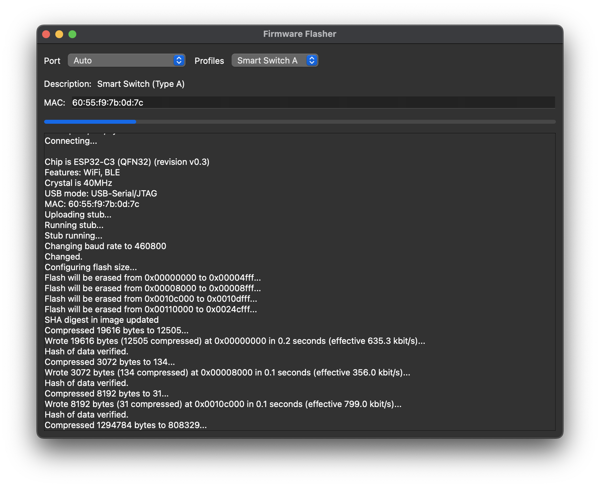

# FW Flash
## Features
* Config with [JSON file](https://github.com/buganini/Fw-Flasher/blob/main/manifest.json)

## Supported Backends
* esptool
* Black Magic Probe
* OpenOCD

## Extra Dependencies for Black Magic Probe
* Download [Arm GNU Toolchain](https://developer.arm.com/downloads/-/gnu-rm) and extract it to the root of the FwFlather so that `arm-none-eabi-gdb` is in the `gcc-arm-none-eabi-X.Y-Z/bin` directory
* Download [OpenOCD](https://github.com/xpack-dev-tools/openocd-xpack/releases) and extract it to the root of the FwFlasher so that `openocd` os in the `*openocd-X.Y-Z/bin` directory

## Screenshots
